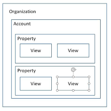
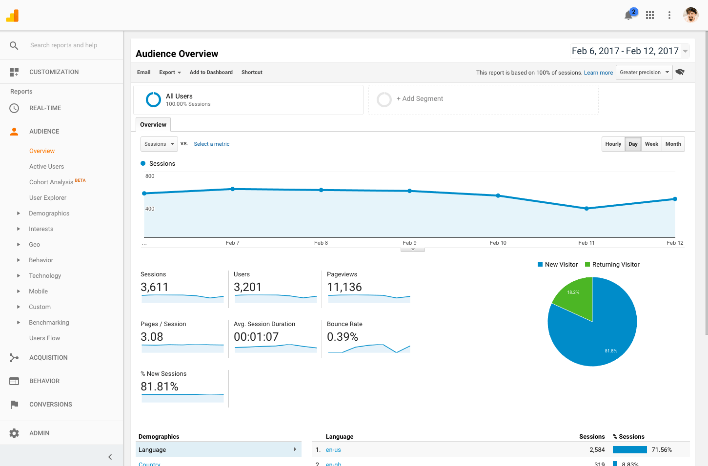

## Google Analytics for Beginners  (Google Analytics Academy)

####  Lesson 1.1:  Why digital analytics?

- acquisition --> behavior --> conversion
- focus ad campaigns
- modify site based on customer use

    
#### Lesson 1.2: How Google Analytics Works
- to collect data, a java script Google Analytics tracking code is added to each page of your website (immediately after the opening <head> tag)
- each time a user visits a webpage, the tracking code collects anonymous information about how the user interacted with the page
- browser and language, device, os - even tells you how user got to your site (traffic source) - did they use a search engine? Click on an ad.
- a **session** begins when a user navigates to a page with a Google analytics code and ends after 30 minutes of inactivity or when the user closes a browser window.
-The Google packages the info and sends it to Google Analytics to process info reports, then Google Analytics aggregates and organizes the data.  You can apply filters to make sure you don't collect your own company's interval traffic - or specific countries, etc. 
-Once Analytics processes the data, it is stored in a database where it cannot be changed.
    

#### Lesson 1.3: Google Analytics Set Up
Your Analytics account determines how data is collected from your websites and manages who can access that data

- Each property can collect data independently of each other using a unique tracking ID that appears in the tracking code
-collect from different web sites, mobile apps or other digital assets
- Each property can have multiple views and you can use filter to determine the data you want in each report
- an Admin can recover a deleted view within 35 days       
- a user with edit permissions at the account level will automatically have edit permissions at the property and view levels as well

Set up Goals to track conversion or business objectives 
-example: how many users signed up for newsletter or how many products sold
    
    
####  Lesson 1.4:  Filter Views
-  IMPORTANT: keep one unfiltered view of your data to ensure that you are always able to access the original data
- Click Admin to see current views - then view settings -- apply filters
- filters can: exclude data from a view, include data in a view, modify how data appears in your reports
- Google Analytics filters data in the order that the filters are applied
- Filters only affect data from after the filter was created
- Enhanced measurement:  
    * page views
    * scrolls
    * outbound clicks
    * site search
    * video engagement
    * file downloads
-Setting up an account and property gives you a new JavaScript tracking code -- whi ch includes your tracking ID
- To find tracking code for a property:  admin -> tracking info -> tracking code
    

####  Lesson 2.1:  Navigating Google Analytics
    
The Google Analytics Interface  
    
Customization Section - allows customization of reports
- Realtime Reports: overiew, locations, traffic sourcess, content, events, conversions
-Audience Reports: characteristics about users: age, gender, where they're from, their interests, their engagement, their techonology, overview, active users, lifetime value, cohort analysis
-Acquisition: which channels brought customers to your site
-Behavior: how people engaged, which pages they viewed, landing and exit pages
-Conversion: track website goals
    
Admin Section - settings
-user permissions
-tracking code
-view settings
-filters
    

#### Lesson 2.2: Understanding Overview Reports
    
Overview Reports offer a high-level summary of metrics in one place  
-Audience Overview: aggregate audience metrics like the number of users, pages they visited, average session duration and bounce rate
-Segment: is like a filter you can apply to look at specific data and compare metrics. The default segment includes all the users who have visited in given date range.
-Date range comparison: allows you to compare two date ranges in a report
-Users: measures users that had at least one session on your site in the given date range
-Bounce rate: the percentage of visits when a user landed on your website and exited without any interactions
-comparison view: compares report data to the website **average**
   
    
#### Lesson 2.3: Understanding Full Reports
Found in a link at the bottom of the 'Audience Overview' Report.
-Summary view: categorizes a dimension by acquisition, behavior and conversion metrics.
-dimension: an attribute of a data set that can be organized for better analysis
-metric: the numbers in a data set often paired with dimensions
-secondary dimension: an additional dimension you can add to a report for more specific analysis
    

#### Lesson 2.4: How to Share Reports
To change report sampling rate, hover over the green check icon. This gives you the percent of sessions your report is based on.  To increase the amount of data in a sample, choose 'greater precision' in the sampling pulldown menu
    
-**greater precision** = more time
-**faster response** = less precise
   
    
#### Lesson 2.5: Dashboards
-Add widget
-Select the 'Share Template Link' in the dashboard to share the dashboard only (with no data)
-when the dashboard is shared with a user, that user can edit the dashboard configuration as they see it.