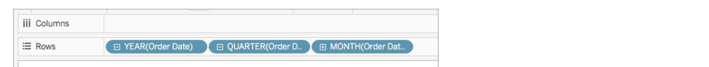

#  Tableau Basics
    

Pill Color: 
- green = measure - can be agggregated (continuous)
- blue = dimension - describes a measure, can't be aggregated (discrete)
    
Breaking down dates:

    
Explaining Data:
    right click any value & choose explain data
    
## Marks & Cards
    
    